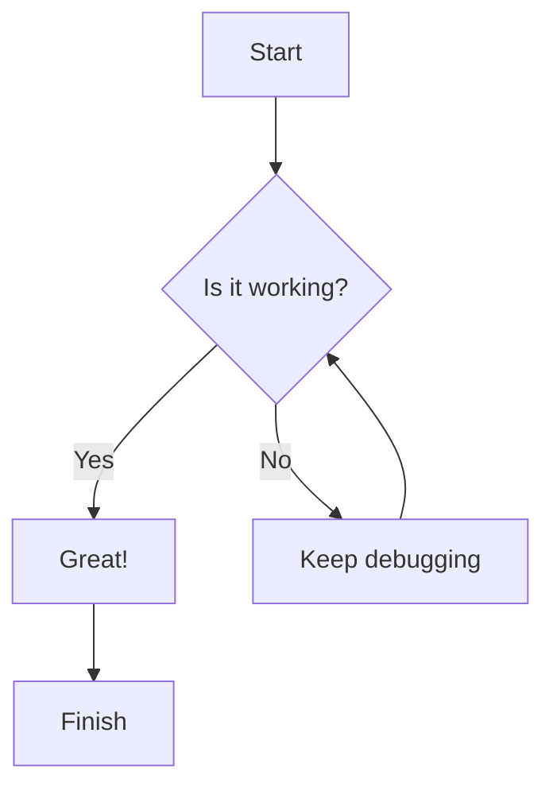
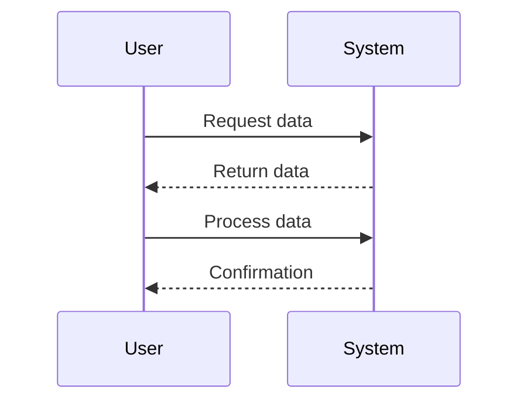

# Mermaid Test

```mermaid
flowchart TD
    A[Start] --> B{Is it working?}
    B -->|Yes| C[Great!]
    B -->|No| D[Keep debugging]
    C --> E[Finish]
    D --> B
```

---

```mermaid
sequenceDiagram
    participant User
    participant System
    
    User->>System: Request data
    System-->>User: Return data
    
    User->>System: Process data
    System-->>User: Confirmation
```
