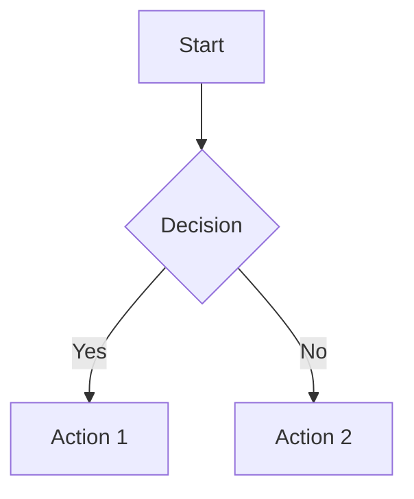

# Reveal.js Mermaid Plugin

A plugin that enables runtime rendering of [Mermaid](https://mermaid.js.org/) diagrams in [Reveal.js](https://revealjs.com/) presentations.

## Features

- **Runtime rendering** - No need to pre-generate SVG files
- **Multiple syntax support** - Both `<div class="mermaid">` and code blocks
- **Fragment support** - Mermaid diagrams work with Reveal.js fragments
- **Responsive design** - Diagrams scale properly on different screen sizes
- **Error handling** - Clear error messages for invalid diagram syntax
- **Theme integration** - Diagrams inherit presentation theme styling

## Installation

1. **Include Mermaid.js library** in your HTML:
   ```html
   <script src="https://cdn.jsdelivr.net/npm/mermaid@11.9.0/dist/mermaid.min.js"></script>
   ```

2. **Include the plugin files**:
   ```html
   <link rel="stylesheet" href="plugin/mermaid/mermaid.css">
   <script src="plugin/mermaid/mermaid.js"></script>
   ```

3. **Register the plugin** in your Reveal.js initialization:
   ```javascript
   Reveal.initialize({
       plugins: [ RevealMermaid ]
   });
   ```

## Usage

### Method 1: Direct HTML (recommended)

```html
<section>
    <h2>My Diagram</h2>
    <div class="mermaid">
        flowchart TD
            A[Start] --> B{Decision}
            B -->|Yes| C[Action 1]
            B -->|No| D[Action 2]
    </div>
</section>
```

### Method 2: Markdown Code Blocks

When using the Reveal.js Markdown plugin, you can use code blocks:

````markdown
## My Diagram


````

### Method 3: With Fragments

```html
<section>
    <h2>Incremental Reveal</h2>
    <div class="fragment">
        <div class="mermaid">
            pie title Pet Adoption
                "Dogs" : 386
                "Cats" : 85
                "Fish" : 15
        </div>
    </div>
</section>
```

## Supported Diagram Types

The plugin supports all Mermaid diagram types:

- **Flowcharts** - `flowchart` or `graph`
- **Sequence Diagrams** - `sequenceDiagram`
- **Class Diagrams** - `classDiagram`
- **State Diagrams** - `stateDiagram`
- **Entity Relationship** - `erDiagram`
- **User Journey** - `journey`
- **Gantt Charts** - `gantt`
- **Pie Charts** - `pie`
- **Git Graphs** - `gitgraph`
- **And more!**

## Configuration

The plugin automatically configures Mermaid with sensible defaults:

```javascript
mermaid.initialize({
    startOnLoad: false,
    theme: 'default',
    securityLevel: 'loose',
    themeVariables: {
        fontFamily: 'inherit'
    }
});
```

You can override these settings by calling `mermaid.initialize()` before Reveal.js initialization.

## Integration with Gistloader

This plugin works seamlessly with the gistloader system:

1. **Update your gist** with Mermaid diagrams using the syntax above
2. **Include the plugin** in your HTML template
3. **Diagrams render automatically** when slides load

Example presentation template:
```html
<!doctype html>
<html>
<head>
    <link rel="stylesheet" href="/dist/reveal.css">
    <link rel="stylesheet" href="/plugin/mermaid/mermaid.css">
    <script src="https://cdn.jsdelivr.net/npm/mermaid@11.9.0/dist/mermaid.min.js"></script>
</head>
<body>
    <div class="reveal">
        <div class="slides"></div>
    </div>
    
    <script src="/dist/reveal.js"></script>
    <script src="/plugin/markdown/markdown.js"></script>
    <script src="/plugin/mermaid/mermaid.js"></script>
    <script src="/js/gistloader.js"></script>
    
    <script>
        Reveal.initialize({
            plugins: [ RevealMarkdown, RevealMermaid ]
        });
    </script>
</body>
</html>
```

## Styling

The plugin includes responsive CSS that ensures diagrams look good in presentations. You can customize the appearance by overriding the CSS classes:

```css
/* Custom diagram styling */
.reveal .mermaid svg {
    max-height: 80vh; /* Adjust max height */
}

/* Theme-specific adjustments */
.reveal.theme-dark .mermaid svg {
    filter: invert(1) hue-rotate(180deg);
}
```

## Troubleshooting

### Diagrams not rendering
- Ensure Mermaid.js is loaded before the plugin
- Check browser console for syntax errors in diagram definitions
- Verify the plugin is registered in Reveal.js initialization

### Diagrams too large
- Use the CSS max-height properties to constrain size
- Consider breaking complex diagrams into multiple slides

### Syntax errors
- The plugin shows detailed error messages for invalid Mermaid syntax
- Use the Mermaid [live editor](https://mermaid.live/) to test diagram syntax

## Examples

See `demo.html` for a complete working example with various diagram types.

## Browser Support

- Chrome 60+
- Firefox 55+
- Safari 11+
- Edge 79+

## License

MIT License - same as Reveal.js
